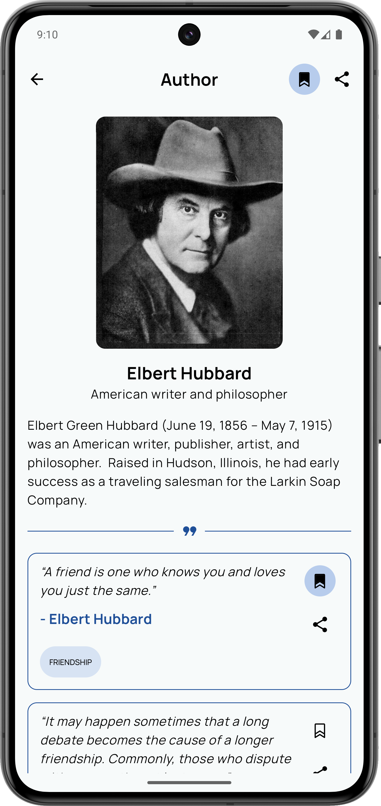

Quottie: Quote of the Day
============

This is the repository for the [Quottie: Quote of the Day](https://github.com/ngapp-dev/Quottie-KMP) Kotlin Multiplatform app. It is always updated and is under development.

**Quottie: Quote of the Day** is a mobile application that helps to find inspiring quotes & famous authors in one app. Bookmark your favorites easily!

The **Quottie: Your Personal Quote Companion** app is built using [Kotlin Multiplatform](https://kotlinlang.org/docs/multiplatform.html), specifically with [Compose Multiplatform](https://github.com/JetBrains/compose-multiplatform), and is under constant development.
The Android part is [available on the Play Store](https://play.google.com/store/apps/details?id=com.ngapp.quottie). The iOS part is in the publishing stage. We are actively writing tests, updating libraries, and implementing new solutions. Currently, we are focused on enhancing the app’s stability and performance through comprehensive testing, including screenshot testing and benchmarking.

In the near future, we plan to expand the app’s capabilities and features even further to provide users with an enriched experience.

# Features

**Quottie: Quote of the Day** is your ultimate source for daily inspiration! 🌟 Dive into a curated collection of uplifting quotes that motivate and encourage you every day. Whether you’re looking for wisdom from famous authors or a quick boost of positivity, Quottie has you covered. All rights to the application belong to [NGApps Dev](https://github.com/ngapp-dev).

📅 Quote of the Day
Start each day with inspiration! Quottie delivers a handpicked “Quote of the Day,” setting the tone for positivity and reflection. Let these powerful words guide and uplift you throughout the day.

🔄 Endless Inspiration with Random Quotes
In need of a quick boost? The Random Quotes feature offers endless scrolling, so you can keep discovering new and inspiring quotes at your own pace. With every scroll, you’ll uncover fresh insights and motivation.

👤 Explore Iconic Authors
Quottie goes beyond quotes. Discover more about the authors behind them! Browse through the profiles of famous authors, learn about their lives, and dive into their unique perspectives on life, success, and happiness.

🔍 Find Exactly What You’re Looking For
Easily search for quotes on specific topics, authors, or keywords. Whether it’s wisdom about life, success, or happiness, Quottie makes finding the perfect quote simple and quick!

📌 Bookmark Your Favorites
Build a personalized collection of quotes and authors that resonate with you. With bookmarks, you’ll always have easy access to the quotes you love most.

## Screenshots

  
  
  

## Libraries used
- 🧩 [Compose Multiplatform](https://github.com/JetBrains/compose-multiplatform) - for UI
- 🌐 [Ktor](https://github.com/ktorio/ktor) - for networking
- 📦 [Kotlinx Serialization](https://github.com/Kotlin/kotlinx.serialization) - for content negotiation
- 🧭 [Compose Navigation](https://www.jetbrains.com/help/kotlin-multiplatform-dev/compose-navigation-routing.html) - for navigation
- 💉 [Koin](https://github.com/InsertKoinIO/koin) - for dependency injection
- 🗃️ [Data Store](https://developer.android.com/jetpack/androidx/releases/datastore) - for storage
- 🛢️ [Room](https://developer.android.com/jetpack/androidx/releases/datastore) - for databasing
- 🏞️ [Moko Resources](https://github.com/icerockdev/moko-resources) - for crossplatform resources
- 🧾 [Napier](https://github.com/AAkira/Napier) - for logging

## Services used
- 📊 [Firebase Analytics](https://github.com/firebase/firebase-android-sdk) - for analytics logging
- 🔎 [Firebase Crashlytics](https://github.com/firebase/firebase-android-sdk) - for crashlytics logging
- 🔒 [Google UMP](https://developers.google.com/interactive-media-ads/docs/sdks/android/client-side/consent) - for showing consent screen
- 📢 [Google AdMob](https://developers.google.com/admob/android/sdk) - for showing ads

## Architecture

The **Quottie: Your Personal Quote Companion** app follows the official architecture guidance which is described in detail in the [Now in Android app architecture learning journey](https://github.com/android/nowinandroid/blob/main/docs/ArchitectureLearningJourney.md).

## UI
The app was designed using [Material 3 guidelines](https://m3.material.io/).

The Screens and UI elements are built entirely using [Jetpack Compose](https://developer.android.com/jetpack/compose).

The app has theme modes, light and dark

## Author

This application was developed by [NGApps Dev](https://github.com/ngapp-dev). I am continuously working on improving the functionality, optimizing the app's performance, and keeping the libraries up-to-date to ensure its stability and relevance.

You can reach me at [ngapps.developer@gmail.com](mailto:ngapps.developer@gmail.com), and feel free to follow my projects on [GitHub](https://github.com/ngapp-dev).

I welcome contributions from the community! Whether it's suggestions, bug fixes, or new features, feel free to open an issue or submit a pull request. Thank you for using the app and for your support!